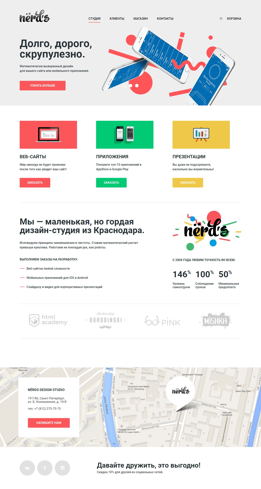
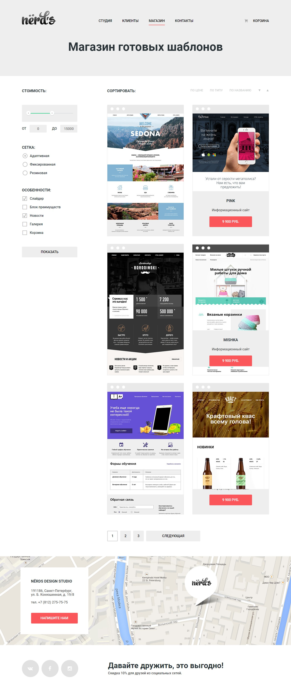

# Проект «Nerds»

* Вёрстка: [Виталий Дубинка (Pixel-Man)](https://github.com/Pixel-Man).
* Макет: [HTML Academy](https://htmlacademy.ru).
* С реализованным проектом можно ознакомится по [ссылке](https://pixel-man.github.io/Nerds/).

## Описание
Проект «Nerds» был выполнен в рамках пройденного онлайн‑курса «Базовый HTML и CSS» от HTML Academy.

* Используемые технологии: _HTML, CSS._
* Фреймворки: _нет_

| Главная страница 1200 | Страница каталог товаров 1200 |
| :------------- | :------------- |
|  |  |
